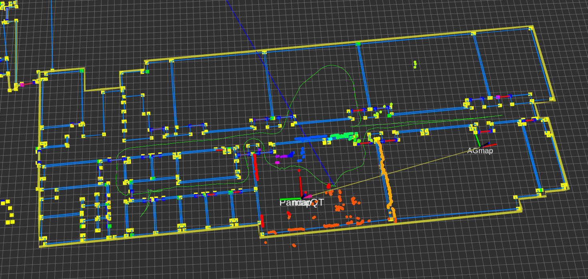

# Localization Using Area Graph

This is a ROS2 package for indoor localization using Area Graphs. It is compatible with the Navigation2 localization module and can replace AMCL, allowing localization combining osmAG and LiDAR.

It needs to be used in conjunction with other packages in the osmAG Navigation Stack:
- `AreaGraphDataParser` (Required, used to parse the osmAG map)
- `wifi_loc` (Optional, if WiFi-based global localization is needed)
- `rss` (Optional, custom message format required for WiFi localization)



## 1. Requirements:

### ROS2 Iron
Install dependencies for this package in one step:
```bash
sudo rosdep init
rosdep update
rosdep install --from-paths src --ignore-src -r -y
```

### Third-party libraries: ceres & its dependencies:
```bash
sudo apt-get update
sudo apt-get install -y libgoogle-glog-dev libgflags-dev
sudo apt-get install -y libatlas-base-dev
sudo apt-get install -y libeigen3-dev
sudo apt-get install -y libsuitesparse-dev
sudo apt-get install -y libceres-dev
```

## 2. Relationships with other packages:

- Relation with `area_graph_data_parser`:
    - `osmAG.xml` -> `area_graph_data_parser` -> ROS2 topics: `/mapPC_AG`, `/AG_index` -> `localization_using_area_graph`
- Relation with `wifi_loc`:
    - `/rss` -> `wifi_loc` -> `/WiFiLocation` -> `localization_using_area_graph`


## 3. Data Preparation:
 - An `osmAG.xml` map file (parsed by the `AreaGraphDataParser` package)
 - A rosbag file (must contain the LiDAR point cloud topic, uniformly remapped to `/hesai/pandar` in the launch file)
    - `/tf`, `/tf_static` (Note: `run.launch.py` outputs absolute `robotPath` pose in the global `map` frame and requires TF to be disabled. However, `agloc_nav2_integration.launch.py`, for Nav2 integration, converts the localization result to TF and publishes it, thus requiring TF.)
    - `/rss` (Collected WiFi signals, required if WiFi localization is enabled)


## 4. Compile and Run:
```bash
(Due to custom message format reasons, the following command to compile `area_graph_data_parser` needs to be executed twice)
colcon build --symlink-install --packages-select area_graph_data_parser
colcon build --symlink-install --packages-select localization_using_area_graph
source install/setup.bash
ros2 launch localization_using_area_graph run.launch.py
```
## 5. Output:
 - Output from `run.launch.py`: Global robot path, estimated by the AGLoc system, published as a ROS2 topic `/RobotPath` under the `map` frame.
 - Output from `agloc_nav2_integration.launch.py`: Real-time updated robot localization, converted to TF and published. The result is reflected in the `map` -> `odom` -> `base_link` TF relationship.


## Operating Modes

### WiFi Global Localization + Pose Tracking
 - Set `bRescueRobot` to `true` in the parameters file.
 - Set `use_global_localization` to `true` in `run.launch.py` and `agloc_nav2_integration.launch.py`.
 - The WiFi localization mechanism can choose to use true AP positions or estimated AP positions, controlled by the `use_true_ap_positions` parameter in the launch file

### Pose Tracking Only
 - Set `bRescueRobot` to `false` in the parameters file.
 - Set `use_global_localization` to `false` in `run.launch.py` and `agloc_nav2_integration.launch.py`.
 - In /config/params.yaml, you need to provide the robot's initial pose relative to the `map` frame (may require estimation/manual input):
    - `initialYawAngle: <yaw_value>`
    - `initialExtrinsicTrans: [<x_value>, <y_value>, 0.0]`